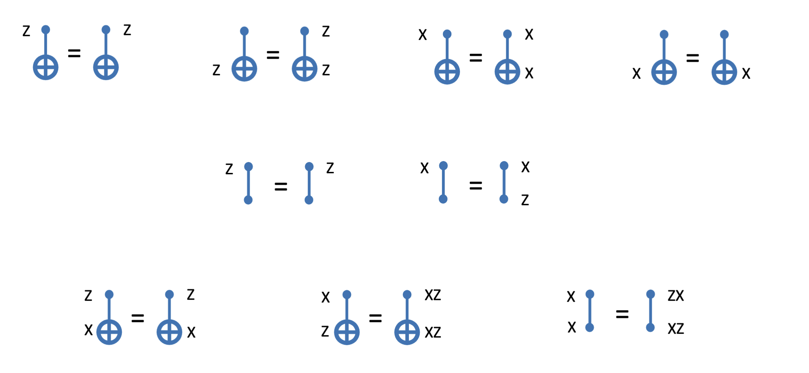

---
tags:
  - react
  - CSS
  - webDev
  - typescript
Status: In progress
Link:
  - https://github.com/Azal-Amer/Quantum-Stabilizer-Demo
---
# Overview

The goal is that given some existing stabilizer generators, make a simple interface for a user to create encoding circuits. I need a live circuit visualizer (I think `quantum-circuit` works for a prototype), a visual for the generators, and then a way to apply the gate maps correctly.

Sources:
https://abdullahkhalid.com/qecft/stabilizer-codes/

# Notes

The goal here is to build some simple intuition for decoding circuits, so for a first prototype I'm going to hardcode the generators in. They can be procedural from a file. This also sets me up for webpage level generation later.
 
>[!quote] "The gates you use are the decoding circuit. To encode, apply the inverse  
of that circuit"
 > - Quantum Computing FRI Slides Lesson 18

|                       |
| ----------------------------------------------------------------------------- |
| ![[assets/StabilizerWebsite Interface Mockup]]Diagram of my potential webpage |
I'm thinking that there are Four total main containers. Three require user interaction: `Generators`, `Instructions`, and `gatePalate`. I can copy the instructions asset and palate from [[../QuantumInfection|QuantumInfection]]. The circuit asset for now is just managed by `quantum-circuit`.

## Assets
### User Interaction
The user only mainly interacts with the generator demo, specifically in the grey box on the furthest right. Each stabilizer demo has $n$ possible bits for it's encoding. The user hovering over a given row highlights the whole thing (to imply that any actions affect the whole). Similar to [[../QuantumInfection]], when doing a controlled operation the highlighting of the control bit is different. I plan to borrow much of the design decisions from that. 

### Instructions
TBD
### Gate palate
Modified from quantum infection, details TBD

### Generator 
This component has to have some sort of listener to hear for row updates. It issues events who's body is the different generator's index objects. A generator is an object who's entries are the gates in an array. Then the gates can be mutated and rendered. 

When a row is clicked, an event is issued out to some kind to a control component. This mutates the affected row(s) based on the existing symmetries. 

> [!Bug] At some point I'll need an undo feature. 

#### Gate Commutation Identities

I should firstly come up with a format to manage this, as it's the heart of the project

## Overview

> [!todo] Todo
> - [ ] Write out objects in TS: Generators, gates, and stabilizers. Ensure the algebra forms a group with test code. If working, random applications should always land us within the space
> - [ ] Create link to `quantum-circuit` so that changes to the palate add to the circuit
> - [ ] Make basic website visual with the generators, no fancy highlighting
> - [ ] Add the gate-palate
> - [ ] Update the hovering visuals
> - [ ] Add the instructions panel
> - [ ] Add undo button?

